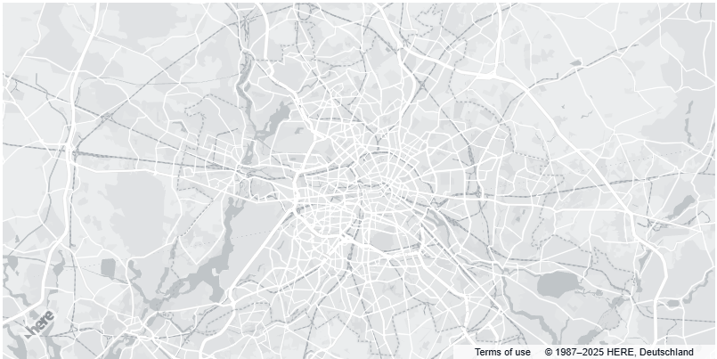

# Grey Map with only background

## Result as follows

## How To
0. Open HERE May Style Editor.
1. Set the size of all Text and Icon to 0
2. Adjust color settings for map elements
3. Export the map style definition JSON file.
4. Upload the file and make it available online.
5. Implement Maps API with referring to it.